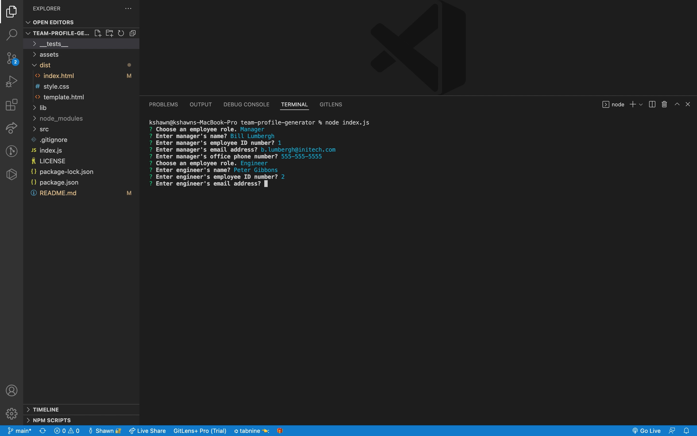
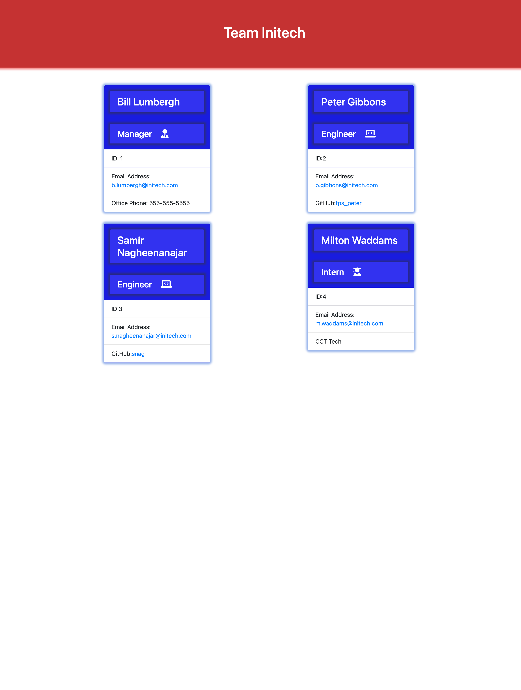
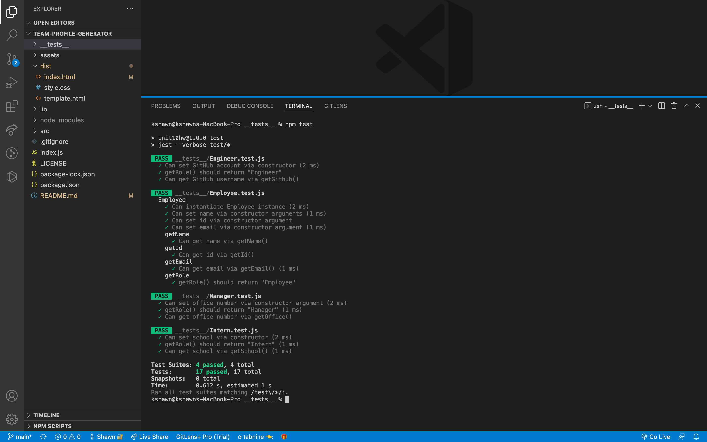

# Team-Profile-Generator

  
  
  ## Table of Contents
  - [Description](#description)
  - [Installation](#installation)
  - [Usage](#usage)
  - [Demo](#demo)
  - [Screenshot](#screenshot)
  - [Testing](#testing)
  - [Lanuages](#languages)
  - [License](#license)
  - [Contact](#contact)

  ## Description
  A Node.js command-line application that takes in information about employees on a software engineering team, then generates an HTML webpage that displays summaries for each person. Also includes unit testing/passing for each part of code.
  
  ## Installation
  To run the application install node modules from the command line using npm i. Then run node index.js. 
 
  ## Usage
  AS A manager of software team you can generate an HTML webpage that displays the team's basic info
  with quick access links to their emails and GitHub profiles.
  
   ## Demo

   
   (https://youtu.be/Cf001jGUMO8)
  ## Screenshot
  
  

  ## Testing
  
  run npm test from the command line
  ## Languages
  JavaScript, HTML, CSS, Bootstrap, Google Fonts, Node, Inquirer, Jest
  
  ## License
  MIT
  
  ## Contact:
  ShawnArgent (https://github.com/ShawnArgent)  
  kshawn001@gmail.com